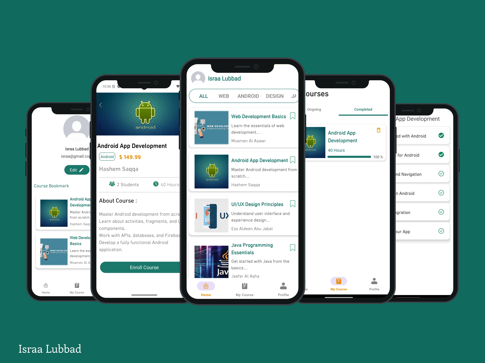
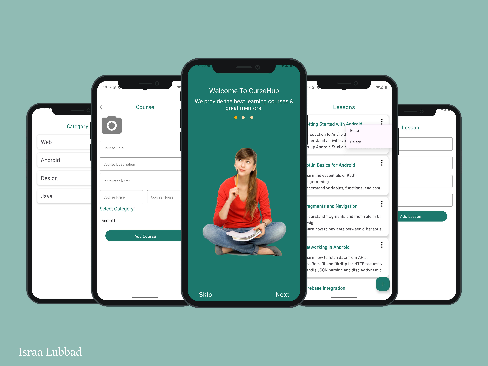

# CourseHub Application

## Overview
**CourseHub** is a fully-featured Android learning platform built with **Native Android (Java)** using **Room Database** for local data storage.  
The app supports **Admin and User functionalities**, providing a smooth learning experience with course management, categorization, lesson tracking, and notifications.

---

## Features

### Admin Features
- Add, edit, and delete courses  
- Add and manage course categories  
- Add lessons with detailed content  
- Automatic notifications to enrolled users when new lessons are added  

### User Features
- User registration and login  
- Onboarding screens for first-time users  
- Browse courses by category   
- View course details and lessons  
- Bookmark favorite courses  
- Enroll in courses  
- Track course progress (Completed / In Progress)  
- **User Profile:**  
  - View personal information  
  - Edit user details (name, email, password, etc.)  
  - View all bookmarked courses  
- Receive notifications for new lessons in enrolled courses  
---

## Screens

### Admin Screens
- **Add Category:** Create new course categories
- **Add Course:** Add new courses with title, description, category, price, and duration    
- **Add Lesson:** Add lessons with titles and content  
- **Course Management:** Edit or delete courses and lessons  
- **Notifications:** Notify users when new lessons are added  

### User Screens
- **Onboarding:** Guided first-time setup  
- **Login / Registration**  
- **Home Screen:** Displays courses and progress tabs (All, Enrolled, Completed)  
- **Course Details:** View course info, lessons, and bookmark courses  
- **Category Tab:** Browse courses by category
-  **User Profile:** View/edit personal info and bookmarked courses  
- **Notifications:** Receive updates when new lessons are added  

---

## Technical Stack
- **Language:** Java  
- **Architecture:** MVVM (Model-View-ViewModel) 
- **Database:** **Room Database** for local data storage  
- **Notifications:** local Notfication 
- **UI:** Material Design with XML layouts  

---

## Screenshots

### User Screens
   

### Admin Screens
  

